<div align="center">

# 🌐 REMITSYNC - 

### Cross-Border Settlement Reliability · Intelligent Recovery · Autonomous Reconciliation

*Make cross-border settlement failures **observable, diagnosable, recoverable and reconcilable**.*

<br/>


</div>

----

## 📑 Table of Contents

1. [Overview](#-overview)
2. [The Problem](#-the-problem)
3. [The Solution](#-the-solution)
4. [Key Features](#-key-features)
5. [System Architecture](#-system-architecture)
6. [End-to-End Workflow](#-end-to-end-workflow)
7. [Recovery Orchestration Sequence](#-recovery-orchestration-sequence)
8. [Transaction State Machine](#-transaction-state-machine)
9. [Drunix Ledger Lifecycle](#-drunix-ledger-lifecycle)
10. [Drunix Network Topology](#-drunix-network-topology)
11. [Three-Way Reconciliation](#-three-way-reconciliation)
12. [Frontend Architecture](#-frontend-architecture)
13. [Data Flow](#-data-flow)
14. [Data Model (ER Diagram)](#-data-model-er-diagram)
15. [ISO 20022 Messages](#-iso-20022-messages)
16. [Application Pages](#-application-pages)
17. [Guided Demo Script](#-guided-demo-script)
18. [Tech Stack](#-tech-stack)
19. [Project Structure](#-project-structure)
20. [Getting Started](#-getting-started)
21. [Environment Variables](#-environment-variables)
22. [Current Status & Roadmap](#-current-status--roadmap)


---

## 🔎 Overview

**REMITSYNC** is an operational orchestration platform for cross-border payments, built for the **Citi × NPCI Drunix Hackathon 2026**.

It sits on top of the payment rails and the distributed ledger and gives operations teams one place to **see** a transaction's true state, **understand** why it stalled, **fix** it automatically over an alternative rail, and **prove** that all systems agree afterwards.

```text
VALIDATE  →  ROUTE  →  MONITOR  →  DIAGNOSE  →  RECOVER  →  RECONCILE
```

> ⚠️ **Prototype note:** the current build is a high-fidelity, **front-end simulation** driven by realistic mock data (ISO 20022 payloads, Drunix blocks, corridor metrics). No real money moves and no real bank/NPCI/Drunix endpoints are called. See [Current Status & Roadmap](#-current-status--roadmap) for exactly what is real and what is simulated.

---

## 🚨 The Problem

> **What happens when a cross-border transaction is accepted by the originating institution, but fails or times out at the destination settlement layer?**

Today the payment often sits in an ambiguous **`IN-FLIGHT`** state:

| Pain point | Consequence |
|---|---|
| Nobody knows if the money is lost, stuck or delivered | Customer support escalations |
| Root cause is buried across bank, switch and gateway logs | Slow manual diagnosis |
| Recovery means manual re-initiation or return-to-sender | Extra fees, FX risk, delays |
| Ledgers at each party drift apart | Nostro breaks and suspense items |
| Reconciliation happens end-of-day, in spreadsheets | Late detection of errors |

---

## 💡 The Solution

REMITSYNC turns that ambiguity into a structured, auditable workflow:


---

## ✨ Key Features

### 🛰️ Observability
- **Live corridor dashboard** with health, volume, latency and STP rate for UAE, Singapore, USA, UK and Saudi Arabia → India corridors
- **Transaction Inspector** with UETR, parties, FX, route, lifecycle stages and full audit trail
- **Rail health matrix** (NPCI IMPS, RTGS, UPI-Direct, NEFT and more) with latency, availability and 24h volume

### 🧠 Intelligent Diagnosis
- **AI Diagnostician** card with confidence score (99.4% in the demo scenario)
- Identifies the failing node, SLA breach ratio and ISO reason code (`RJCT / AC04`, `DS04`)
- Pre-checks **Nostro liquidity** and **FX-rate lock** before recommending action
- Ranks **alternative rails** by latency, success rate and cost delta

### 🔁 Autonomous Recovery
- One-click **Run Recovery** executes a multi-step failover sequence with a live log
- Fails over from a stalled RTGS gateway to the **NPCI IMPS rail via Citi Direct Node**
- Zero FX slippage: the rate stays locked on the Drunix smart contract
- Issues an ISO 20022 **`pacs.004`** reroute notice

### ⛓️ Drunix Ledger Integration (simulated)
- Full **5-stage lifecycle**: Proposed → Endorsed → Ordered → Validated → Committed
- Segregated **Lite Peers / Committing Peers / SVS / Raft Orderers** topology view
- **YugabyteDB SQL console**: query the ledger with plain SQL and see the state change after recovery
- Block explorer with hashes, previous-hash chain and validation codes

### ⚖️ Autonomous Reconciliation
- **Three-way match** across Citi TTS Core, Drunix DLT and NPCI Clearing Gateway
- **Break simulator** injects a Nostro mismatch and shows auto-healing
- Exports/inspects a **`camt.053`** statement

### 🎭 Role-Based Views
| Role | Persona | Focus |
|---|---|---|
| `citi_ops` | Citi TTS Cross-Border Ops Lead | Monitor and recover payments |
| `npci_auditor` | NPCI Chief Settlement Auditor | Audit and reconciliation |
| `drunix_dev` | Drunix Core Infrastructure Engineer | Ledger internals and SDK |

### 🧭 Judge-Friendly Demo Mode
- Persistent **8-step Demo Guide Bar** with next/previous and reset
- **Zero-login mode**: if no Clerk key is set, the app runs directly, with no sign-in friction

---

## 🏗️ System Architecture

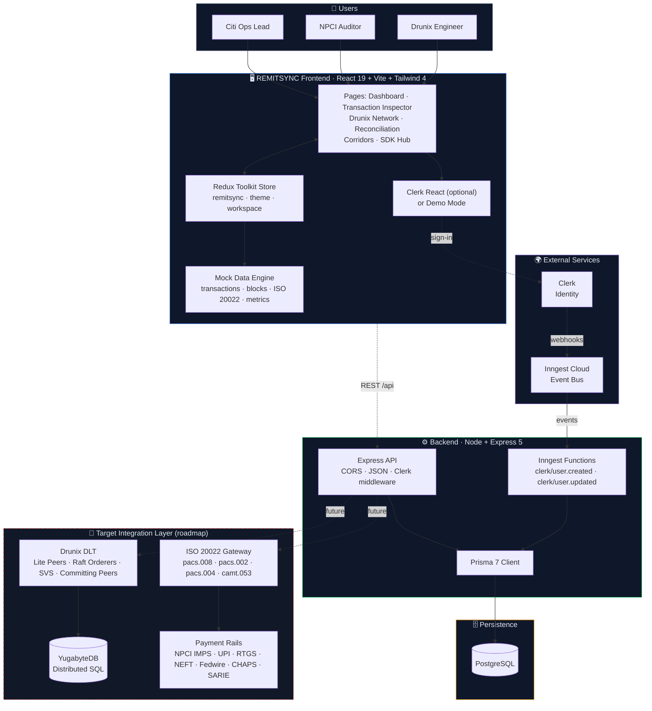

**Solid lines** are implemented today. **Dashed lines** are planned or optional integrations.

### Layered View

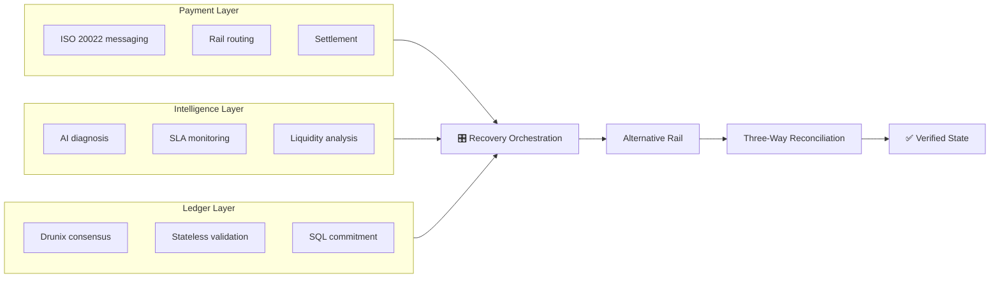

---

## 🔄 End-to-End Workflow

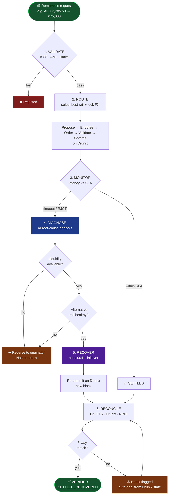

---

## 🎬 Recovery Orchestration Sequence

This is the exact sequence executed when an operator clicks **Run Recovery** on transaction `RSX-928173`.

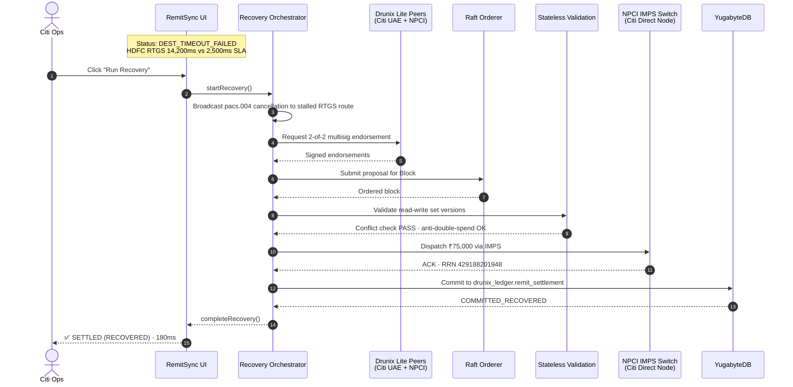

---

## 🔀 Transaction State Machine

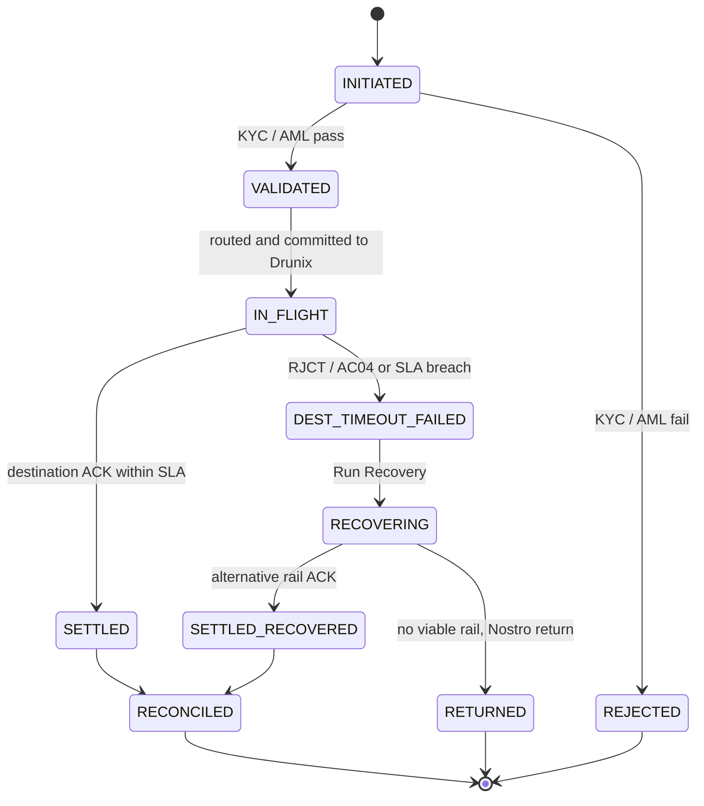

---

## ⛓️ Drunix Ledger Lifecycle

Every transaction passes through five stages before it is final.

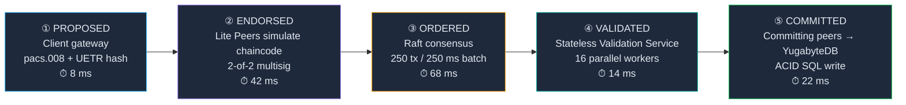

| # | Stage | Responsible node | What happens | Latency |
|---|---|---|---|---|
| 1 | **Proposed** | RemitSync Client Gateway | Proposal packaged with ISO 20022 metadata, signed with the participant's X.509 certificate | 8 ms |
| 2 | **Endorsed** | Lite Peers (Citi UAE + NPCI Gateway) | Chaincode simulated in sandbox; 2-of-2 endorsement policy | 42 ms |
| 3 | **Ordered** | Raft Orderer cluster | Strict total order, Merkle state roots, chained block headers | 68 ms |
| 4 | **Validated** | Stateless Validation Service | Parallel read-write set, signature and double-spend checks | 14 ms |
| 5 | **Committed** | Committing Peers + YugabyteDB | ACID commit to distributed SQL, so ledger state is directly queryable | 22 ms |

---

## 🕸️ Drunix Network Topology

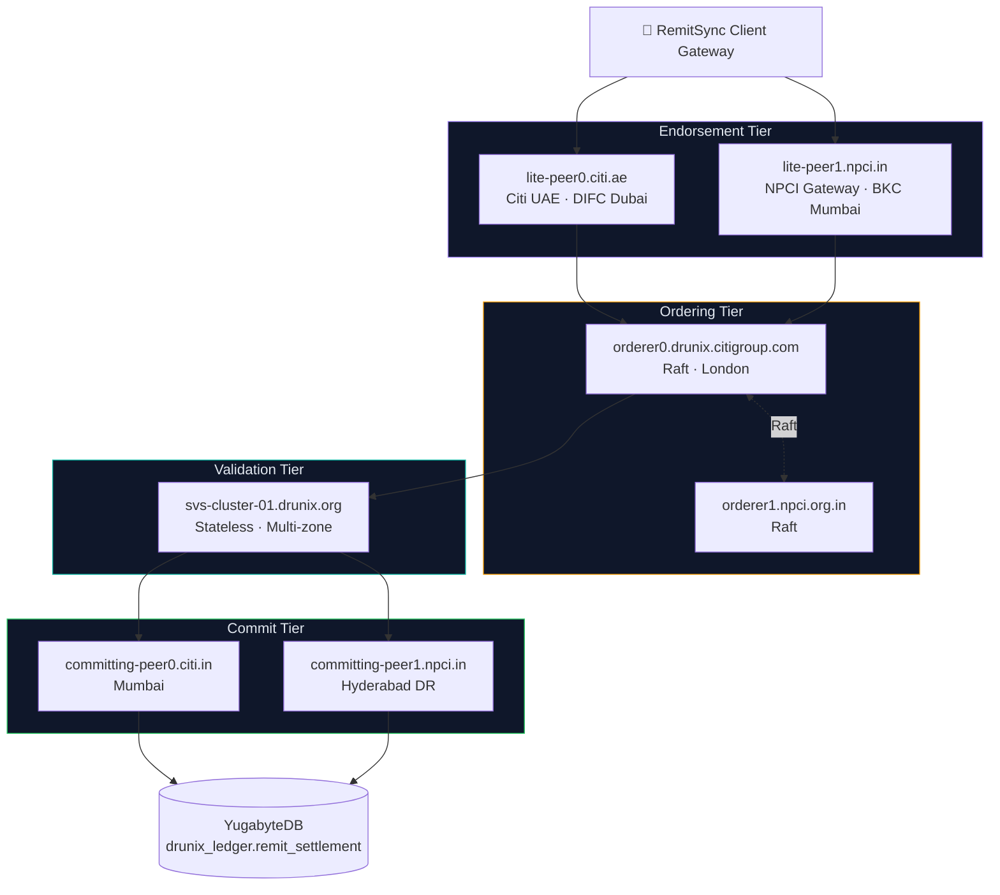

Unlike a classic Hyperledger Fabric setup with LevelDB/CouchDB key-value state, the Drunix model shown here commits to **distributed SQL**, so operations and audit teams can run ordinary SQL against the ledger.

---

## ⚖️ Three-Way Reconciliation

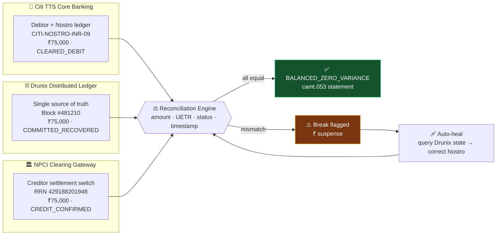

**Demo figures:** 1,420 transactions · ₹412.8M volume · 100.00% match rate · ₹0.00 net Nostro variance. Clicking **Simulate Clearing Break** drops the match rate to 99.28% and shows a ₹75,000 suspense item.

---

## 🧩 Frontend Architecture

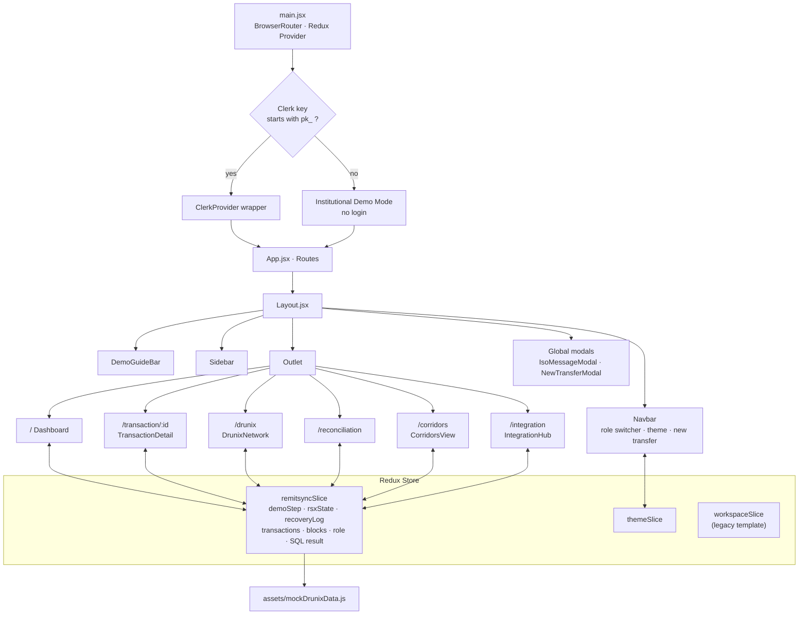

### Redux `remitsync` slice

| State | Purpose |
|---|---|
| `demoStep` (1-8) | Position in the guided demo |
| `rsxState` | `initial` → `recovering` → `recovered` |
| `recoveryStepIndex`, `recoveryLog` | Drives the live recovery timeline |
| `transactions` | Corridor transaction list (status mutates on recovery) |
| `drunixBlocks` | Block explorer data |
| `isSimulatingBreak` | Reconciliation break toggle |
| `activeUserRole` | `citi_ops` / `npci_auditor` / `drunix_dev` |
| `sqlQuery`, `sqlExecutionResult` | YugabyteDB console |
| `isIsoModalOpen`, `activeIsoMessageType` | ISO 20022 XML viewer |

---

## 📡 Data Flow

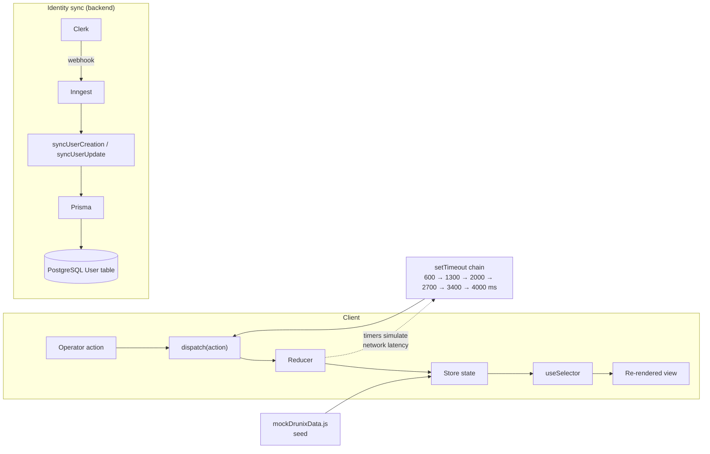

---

## 🗃️ Data Model (ER Diagram)

The Prisma schema (`server/prisma/schema.prisma`) currently contains the identity and workspace foundation inherited from the project scaffold. Payment entities are modelled in the front-end mock layer and mapped to the target SQL schema shown in the SDK Hub.

### Persisted today (PostgreSQL via Prisma)

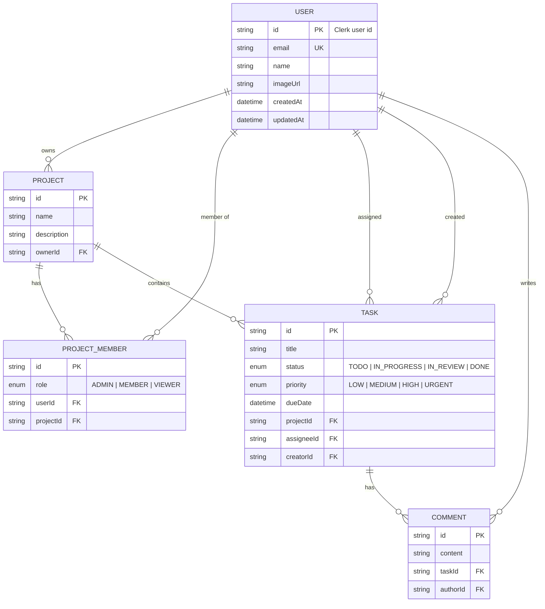

### Target ledger schema (Drunix / YugabyteDB, from the SDK Hub)

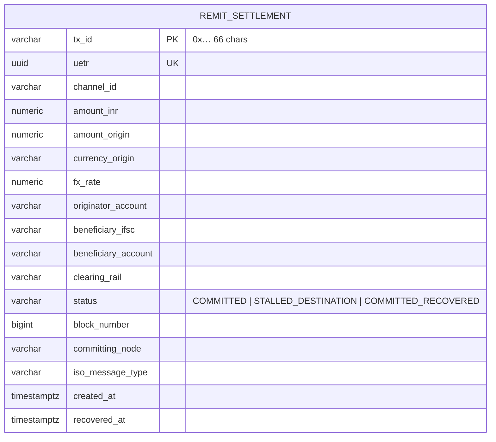

---

## 📨 ISO 20022 Messages

The **ISO Message Modal** renders real XML for each stage of the scenario.

| Message | Version | Role in the flow |
|---|---|---|
| `pacs.008` | 001.10 | FI-to-FI customer credit transfer, the initiation |
| `pacs.002` | 001.12 | Payment status report, carries the `RJCT / AC04` failure |
| `pacs.004` | 001.11 | Payment return / autonomous reroute notice |
| `camt.053` | 001.10 | Bank-to-customer statement, three-way balanced |

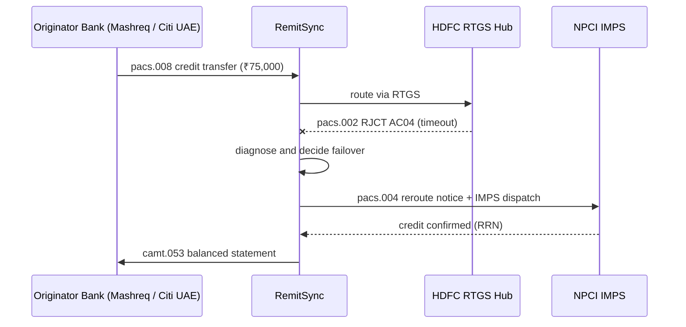

---

## 🧭 Application Pages

| Route | Page | Description |
|---|---|---|
| `/` | **Overview** | Corridor health cards, KPIs, transaction ledger, recent activity, "New Transfer" |
| `/transaction/:id` | **Transaction Inspector** | Lifecycle, failure alert, AI diagnosis, alternative rails, **Run Recovery**, audit trail, ISO viewer |
| `/drunix` | **Drunix Network** | 5-stage lifecycle explorer, peer topology, block explorer, SQL console |
| `/reconciliation` | **Reconciliation** | Three-way match, break simulator, `camt.053` inspector |
| `/corridors` | **Corridors & Rails** | Corridor metrics and rail health matrix |
| `/integration` | **Drunix SDK Hub** | Copy-ready Node.js SDK snippet and YugabyteDB SQL schema |

`/transaction` redirects to `/transaction/RSX-928173`. Unknown routes redirect to `/`.

---

## 🎯 Guided Demo Script

The 8-step **Demo Guide Bar** walks judges through the whole story.

| Step | Action | Where |
|---|---|---|
| 1 | **Open Overview**: see corridor health and the flagged transaction | `/` |
| 2 | **Click `RSX-928173`**: UAE (AED 3,285.50) → India (₹75,000) | `/transaction/RSX-928173` |
| 3 | **Inspect Failure State**: HDFC RTGS timeout at 14,200 ms (`RJCT / AC04`) | same |
| 4 | **Review AI Diagnosis**: liquidity verified, FX locked, IMPS recommended | same |
| 5 | **Click Run Recovery**: watch the multi-step autonomous failover | same |
| 6 | **Verify Settled State**: `SETTLED_RECOVERED`, Drunix Block #481210, `pacs.004` | same |
| 7 | **Open Drunix Network**: lifecycle, peers, SQL console | `/drunix` |
| 8 | **Open Reconciliation**: zero variance, then try the break simulator | `/reconciliation` |

**Scenario numbers:** FX 22.8275 AED/INR · fee AED 15 · failure latency 14,200 ms vs SLA 2,500 ms (568% over) · recovery latency 180 ms · Nostro pool `CITI-NOSTRO-INR-09`.

### Alternative rails evaluated by the diagnostician

| Rail | Status | Latency | Success rate | Cost delta | Chosen |
|---|---|---|---|---|---|
| NPCI IMPS (Citi Direct Gateway) | 🟢 OPTIMAL | 92 ms | 99.98% | ₹0.00 | ✅ |
| RBI RTGS Secondary (Axis Hub) | 🟠 DEGRADED | 8,400 ms | 89.20% | +₹18.00 | ❌ |
| Reverse to Originator (Nostro return) | 🔵 AVAILABLE | 2,100 ms | 100% | +AED 25.00 | ❌ |

---

## 🧰 Tech Stack

| Layer | Technology |
|---|---|
| **Frontend** | React 19, Vite 7, React Router 7, Redux Toolkit 2, Tailwind CSS 4 |
| **UI / Viz** | Recharts, Lucide React, React Hot Toast, date-fns |
| **Auth** | Clerk (`@clerk/clerk-react`, `@clerk/express`), optional demo mode |
| **Backend** | Node.js (ESM), Express 5, CORS, dotenv |
| **Workflows** | Inngest (Clerk webhook → user sync) |
| **Database** | PostgreSQL through Prisma 7 (`prisma-client` generator) |
| **Domain standards** | ISO 20022 (`pacs.008/002/004`, `camt.053`), UETR |
| **Ledger (simulated)** | Drunix DLT, Raft ordering, Stateless Validation Service, YugabyteDB SQL |
| **Hosting** | Vercel (client SPA rewrites + `@vercel/node` server) |
| **Tooling** | ESLint 9, Nodemon |

---

## 📁 Project Structure

```text
Remitsync/
├── package.json                 # root scripts proxying to client
├── client/                      # React + Vite SPA
│   ├── index.html
│   ├── vite.config.js
│   ├── vercel.json              # SPA rewrite → /
│   └── src/
│       ├── main.jsx             # Clerk-or-demo bootstrap
│       ├── App.jsx              # Route table
│       ├── app/store.js         # Redux store
│       ├── features/
│       │   ├── remitsyncSlice.js   # core domain state & reducers
│       │   ├── useAuth.js          # persona/role hook
│       │   ├── themeSlice.js
│       │   └── workspaceSlice.js   # legacy scaffold
│       ├── assets/
│       │   └── mockDrunixData.js   # transactions, blocks, peers, ISO XML, reconciliation
│       ├── pages/
│       │   ├── Layout.jsx
│       │   ├── Dashboard.jsx
│       │   ├── TransactionDetail.jsx
│       │   ├── DrunixNetwork.jsx
│       │   ├── Reconciliation.jsx
│       │   ├── CorridorsView.jsx
│       │   └── IntegrationHub.jsx
│       └── components/
│           ├── DemoGuideBar.jsx
│           ├── Navbar.jsx · Sidebar.jsx
│           ├── IsoMessageModal.jsx
│           └── NewTransferModal.jsx
└── server/                      # Express + Prisma + Inngest
    ├── server.js                # app bootstrap
    ├── inngest/index.js         # Clerk → DB sync functions
    ├── configs/prisma.js        # Prisma client
    ├── prisma.config.ts         # datasource / migrations config
    ├── prisma/schema.prisma     # data model
    └── vercel.json              # serverless deploy config
```

---

## 🚀 Getting Started

### Prerequisites

- **Node.js 20+** and **npm**
- *(Optional, for the backend)* a **PostgreSQL** database, a **Clerk** application and an **Inngest** account

### 1. Clone

```bash
git clone https://github.com/charveemasand108/Remitsync.git
cd Remitsync
```

### 2. Run the demo (frontend only, no accounts needed)

```bash
cd client
npm install
npm run dev
```

Open **http://localhost:5173**. With no Clerk key set, the app starts in **Institutional Demo Mode** and needs no login.

You can also run from the repo root:

```bash
npm run dev       # start Vite dev server
npm run build     # production build → client/dist
npm run preview   # preview the production build
npm run lint      # ESLint
```

### 3. Enable Clerk sign-in (optional)

Create `client/.env`:

```bash
VITE_CLERK_PUBLISHABLE_KEY=pk_test_xxxxxxxxxxxxxxxxxxxx
```

Any key starting with `pk_` switches the app from demo mode to Clerk-wrapped mode.

### 4. Run the backend (optional)

```bash
cd server
npm install
cp .env.example .env        # if you create one; see variables below
npx prisma generate
npx prisma migrate dev      # create tables
npm run dev                 # nodemon on http://localhost:5000
```

Health check: `GET /` returns `Server is live!`. The Inngest endpoint is served at `/api/inngest`.

For local Inngest development:

```bash
npx inngest-cli@latest dev -u http://localhost:5000/api/inngest
```

---

## 🔐 Environment Variables

### `client/.env`

| Variable | Required | Description |
|---|---|---|
| `VITE_CLERK_PUBLISHABLE_KEY` | No | Clerk publishable key (`pk_…`). Omit to run in demo mode |

### `server/.env`

| Variable | Required | Description |
|---|---|---|
| `PORT` | No | API port (default `5000`) |
| `DATABASE_URL` | Yes | PostgreSQL connection string (runtime) |
| `DIRECT_URL` | No | Direct (non-pooled) connection used by Prisma migrations; falls back to `DATABASE_URL` |
| `CLERK_PUBLISHABLE_KEY` | Yes | Clerk publishable key for `clerkMiddleware` |
| `CLERK_SECRET_KEY` | Yes | Clerk secret key |
| `INNGEST_EVENT_KEY` | Prod | Inngest event key |
| `INNGEST_SIGNING_KEY` | Prod | Inngest signing key for `/api/inngest` |

---

## ☁️ Deployment

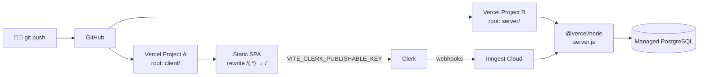

- **Client:** deploy `client/` to Vercel (build `npm run build`, output `dist`). `client/vercel.json` rewrites all paths to `/` for SPA routing.
- **Server:** deploy `server/` to Vercel; `server/vercel.json` routes all requests to `server.js` via `@vercel/node`.
- Set all environment variables in the Vercel project settings.

---

## 🧪 Current Status & Roadmap

An honest map of what is implemented and what is simulated:

| Area | Status |
|---|---|
| Dashboard, Transaction Inspector, Drunix, Reconciliation, Corridors, SDK Hub UI | ✅ Implemented |
| Recovery workflow, role switching, break simulator, SQL console, ISO XML viewer | ✅ Implemented (client-side simulation over mock data) |
| Guided 8-step demo + demo (no-login) mode | ✅ Implemented |
| Clerk auth (optional) | ✅ Implemented |
| Clerk → PostgreSQL user sync via Inngest | ✅ Implemented |
| Payment / transaction persistence in PostgreSQL | 🔜 Not yet, transactions live in mock data and Redux |
| REST API for remittances (`/api/*`) | 🔜 `server.js` mounts `./api/index.js`, which is not in the repo yet |
| Real ISO 20022 gateway and rail connectors | 🔮 Planned |
| Real Drunix / YugabyteDB integration (SDK Hub snippet is illustrative) | 🔮 Planned |
| Real AI diagnostician (currently deterministic scripted output) | 🔮 Planned |
| Automated tests / CI | 🔮 Planned |

### Roadmap

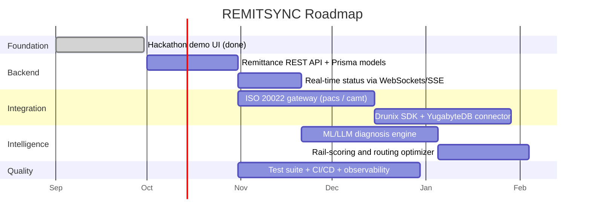

> The roadmap dates are indicative and meant to show sequencing, not commitments.

---

.

---


<div align="center">

**REMITSYNC** · Built for the **Citi × NPCI Drunix Hackathon 2026**

*From ambiguous `IN-FLIGHT` to verified, reconciled, settled.*

</div>
